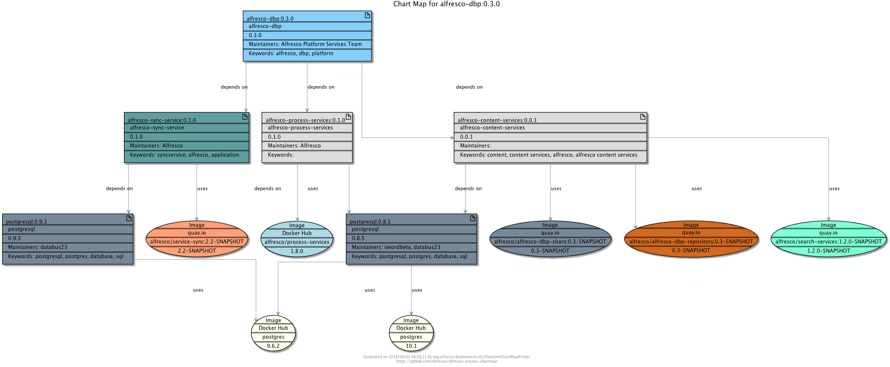

# Chart Map

## Overview

This project generates a file that shows the recursive dependencies of a Helm Chart.  

The generated file can be in either PlantUML text format or in a plain text format.  

The most useful format is PlantUML since this offers a visual representation of the chart dependencies.  See the example below.
For more information about PlantUML, see http://plantuml.com/.  

Note that although this project was created in the Alfresco GitHub org, ChartMap can be used with any Helm Chart.   An illustration of this point can be found in the examples.

## Prerequisites

The Helm Client is required since the chart map is based on the dependencies discovered by the Kubernetes Helm client. I have tested it with v2.7.2 of the Helm Client though other versions may also work. 

For instructions on installing the Helm Client, see https://docs.helm.sh/using_helm/#installing-helm

The junit test cases rely on the environment variable *HELM_HOME* being set.


## Using Chart Map

### Setup

1. Download the executable jar from the [resource directory](./resource/jar), or build it yourself from source (see below).

2. Run the command line, or write a Java program, to generate a chart.  See Syntax and Examples below.

### Command Line Syntax

```
                                    
java ---<filename>---+---a <apprspec>----+---o <filename>---d <directoryname>---+------------------+--+-------+---+-------+---+-------+
                     |                   |                                      |                  |  |       |   |       |   |       |
                     +---c <chartname>---+                                      +---e <filename ---+  +---r---+   +---v---+   +---h---+
                     |                   |                                                                       
                     +---f <filename>----+                                                                       
                     |                   |                                                                       
                     +---u <url>---------+        
                   
```

#### Parameters

* **Required**
   * To specify the Helm Chart, one of the following input formats must be specified
     * **-a** \<apprspec\>
          *  The name and version of the chart as an appr specification \<host\>/\<org\>/\<chart-name\>@\<chart-version\>   
     * **-c** \<chartname\>
          *  The name and version of the chart in the format \<chart-name\:chart-version\>
     * **-f** \<filename\>
          *  The location in the file system for a Helm Chart package (a tgz file)
     * **-u** \<url\>
          *  A url for the Helm Chart
   * **-d** \<directoryname\>
      * The file system location of HELM_HOME 
   * **-o** \<filename\>
      * The name of the file to be generated.  If a file extension of 'puml' is specifed the format of the generated file will be PlantUML.  Otherwise it will be plain text. 
* **Optional**
   * **-e** \<filename\>
      *  The location of an Environment Specification which is a yaml file containing a list of environment variables to set before rendering helm templates.  See the example environment specification provided in resource/example-env-spec.yaml to understand the format. 
   * **-h**
      * Help.  Whenever specified, any other parameters are ignored.  When no parameters are specified, **-h** is assumed.
   * **-r**
      * Refresh.  If specified, the Helm command *helm update dependencies* will be run before generating the chart map
   * **-v**
      * Verbose.  If specified, some extra command line output is shown
 
#### Example Commands

##### Generating a Chartmap using a chart reference 
```
java -jar chartmap-1.0-SNAPSHOT.jar -c "wordpress:0.8.17" -r -v -o "wordpress.puml" -d "/Users/melahn/.helm"
```
##### Generating a Chartmap using a file specification
```
java -jar chartmap-1.0-SNAPSHOT.jar -f "/Users/melahn/helm/alfresco-content-services-1.0.1.tgz" " -d "/Users/melahn/.helm" -o  alfresco-dbp.puml -v

```
##### Generating a Chartmap using a url specification
```
java -jar chartmap-1.0-SNAPSHOT.jar -u "http://kubernetes-charts.alfresco.com/stable/alfresco-content-services-1.0.1.tgz" " -d "/Users/melahn/.helm" -o  alfresco-dbp.puml -v

```
##### Generating a Chartmap using an appr specification
```
java -jar chartmap-1.0-SNAPSHOT.jar -a "quay.io/alfresco/alfresco-dbp@0.2.0" -d "/Users/melahn/.helm" -o  alfresco-dbp.puml -v

```

### Java Methods

In addition to the command line interface, a Java API is provided.


#### Constructor
```
    public ChartMap(ChartOption option,
                    String chart,
                    String outputFilename,
                    String helmHome,
                    String envFilename,
                    boolean refresh,
                    boolean verbose)
                    
```                  
##### Description
Constructs a new instance of the *org.alfresco.deployment.util.ChartMap* class

##### Parameters
* *option*            
  * The format of the Helm Chart 
* *chart*             
  * The name of the Helm Chart in one of the formats specified by the option parameter
* *outputFilename*     
  * The name of the file to which to write the generated Chart Map.  Note the file is overwritten if it exists.
* *helmHome*          
  * The location of Helm Home
* *envSpecFilename*          
    * The location of an Environment Specification which is a yaml file containing a list of environment variables to set before rendering helm templates, or <null>.  See the example environment specification provided in resource/example-env-spec.yaml to understand the format. 
* *refresh*            
  * When *true*, refresh the local Helm repo (default *false*)
* *verbose*           
  * When *true*, provides a little more information as the Chart Map is generated (default *false*)
                                          

##### Throws
* *java.lang.Exception*

#### print

##### Description
Prints a *ChartMap* 

```
    public void print ()
                    
```    
##### Parameters
* None

##### Throws
* *java.io.Exception*

#### Java Example
```
import org.alfresco.deployment.util.ChartMap;
import org.alfresco.deployment.util.ChartOption;

public class ChartMapExample {
    public static void printExampleChartMap(String[] args) {
        try {
            ChartMap testMap = new ChartMap(
                    ChartOption.FILENAME,
                    "/examples/example-chart.tgz",
                    "/examples/example-chart.puml",
                    System.getenv("HELM_HOME"),
                    false,
                    true);
            testMap.print();
        } catch (Exception e) {
            System.out.println("Exception generating chart map: " + e.getMessage());
        }
    }
}
```
More examples illustrating the use of the Java interface can be found in [ChartMapTest.java](./src/test/java/org/alfresco/deployment/util/ChartMapTest.java).
 
### Examples of Generated Files

#### Example Image generated from a PlantUML file generated by Chartmap




Note that the colors chosen for a chart are randomly selected from a standard set of PlantUML
colors (see [PlantUML Colors](http://plantuml.com/color)) using a method that will depict
Helm Charts or Docker Files that differ only by their version using the same color.   For example 'postgresql:0.8.5'
and 'postgresql:0.8.7' will be depicted with the same color.  This will make it easier to spot
cases you may want to optimize a deployment to use a common Helm Chart or Docker Image instead.

Helm Charts are depicted as rectangular objects.   Docker Images are depicted as ovals.

Dependencies of Helm Charts on other Helm Charts are shown as green lines.   Dependencies of Helm Charts on Docker Images are shown as orange lines.

#### Example PlantUML File generated by Chartmap

[chartmap-example.puml](./resource/example/example-chartmap.puml)

#### Example Text File generated by Chartmap

[chartmap-example.txt](./resource/example/example-chartmap.txt)


### Maven Commands

#### Building the jar from source

1.  git clone this repository
2.  Run Maven
```
mvn clean package -Dmaven.test.skip=true 

```
#### Running Tests
1.  git clone this repository
2.  Run Maven
```
mvn test

```

#### Building Image files from PUML source
1.  Git clone this repository
2.  Copy any PUML files into the source directory
3.  Run Maven
```
mvn com.github.jeluard:plantuml-maven-plugin:generate
```

