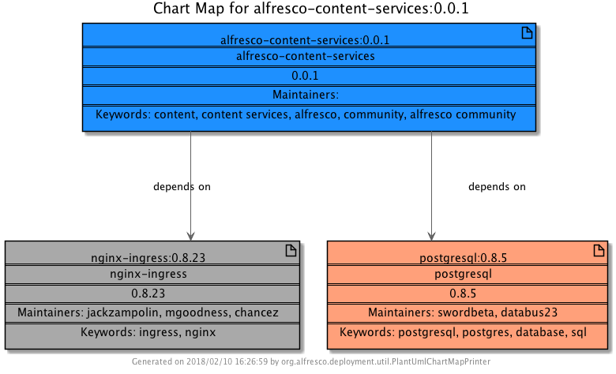

# Chart Map

## Overview

This project generates a file that shows the dependencies of a Helm Chart.

The generated file can be in either PlantUML text format or in a plain text format.  

The most useful format is PlantUML since this offers a visual representation of the chart dependencies.  See the example below.
For more information about PlantUML, see http://plantuml.com/. 

## Prerequisites

The Helm Client is required since the chart map is based on the dependencies discovered by the Kubernetes Helm client. I have tested it with v2.7.2 of the Helm Client though other version may work. 

For instructions on installing the Helm Client, see https://docs.helm.sh/using_helm/#installing-helm


## Using Chart Map

### Setup

1. Download the jar from the [resource directory](./resource/jar), or build it yourself from source (see below).

2. Update the dependencies of the Helm Chart that you want to build a map from. For example,
```
helm dependency update alfresco-content-services
```
3. Run the command line to generate the chart.  For example, 
```
java -jar chartmap-1.0-SNAPSHOT.jar -c "alfresco-content-services:0.0.1" -d "/Users/user/.helm" -o alfresco-content-services.puml 
``` 

### Command Line Syntax

* **REQUIRED**
   * **-c** \<chart name and version\>
      * The name and version of the chart in the format \<chart-name\:chart-version\>
   * **-d** \<directory name\>
      * The file system location of HELM_HOME 
   * **-o** \<output file name\>
      * The name of the file to be generated.  If a file extension of 'puml' is specifed the format of the generated file will be PlantUML.  Otherwise it will be plain text. 
* **OPTIONAL** 
   * **-h**
      * Help
   * **-v**
      * If specified, some extra command line output is shown
 
## Example Output (PlantUML) File

https://github.com/Alfresco/alfresco-anaxes-chartmap/blob/master/resource/example/alfresco-content-services.puml

## Example Image generated from PlantUML file



## Building the jar from source

1.  git clone this repository
2.  Run Maven, e.g. 
```
maven package -Dmaven.test.skip=true 

```

